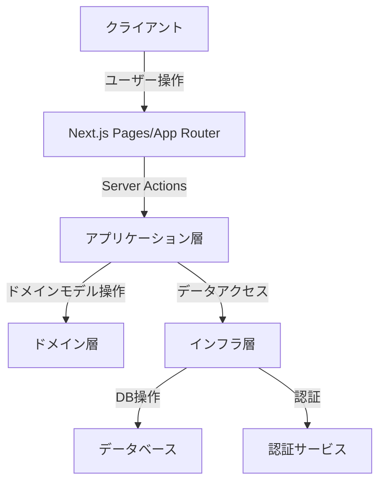
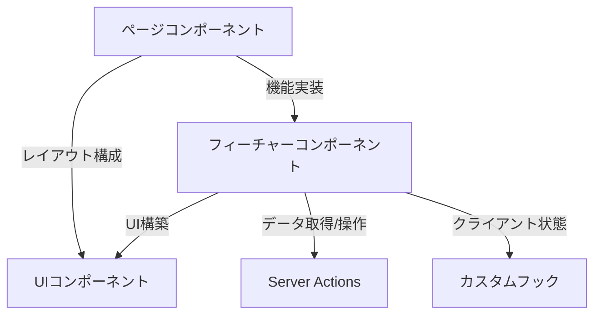
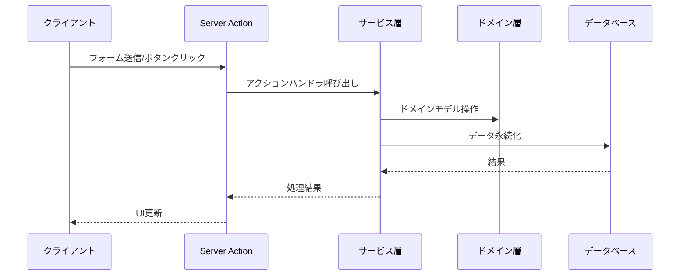

# フロントエンド設計ドキュメント

このドキュメントでは、アプリケーションのフロントエンド部分の設計と実装について説明します。

## 1. アーキテクチャ概要

### 1.1 全体構造

このプロジェクトは、Next.jsを使用したフロントエンドとバックエンドを統合したアプリケーションです。フロントエンドは、Bulletproof Next.jsのディレクトリ構造を参考にした構成を採用しています。



### 1.2 主要コンポーネント

フロントエンドは以下の主要コンポーネントで構成されています：

1. **ページコンポーネント**: ユーザーインターフェースの主要な画面
2. **UIコンポーネント**: 再利用可能なUIパーツ
3. **フィーチャーコンポーネント**: 特定の機能に関連するコンポーネント
4. **Server Actions**: サーバーサイドで実行される処理
5. **クライアントフック**: クライアントサイドの状態管理とロジック

## 2. ディレクトリ構造

### 2.1 基本構造

```
/
├── app/                 # Next.js App Routerのルートディレクトリ
├── views/               # コンポーネントページ
├── components/          # 共通UIコンポーネント
├── features/            # 機能別モジュール
│   └── [feature]/       # 特定機能のコンポーネントとロジック
│       ├── actions/     # Server Actions
│       ├── components/  # 機能固有コンポーネント
└── hooks/               # カスタムReactフック
```

### 2.2 コンポーネント構造



## 3. コンポーネント設計

### 3.1 UIコンポーネント

共通で使用される再利用可能なUIコンポーネントは`components/ui/`ディレクトリに配置されています。これらのコンポーネントはビジネスロジックを含まず、純粋な表示のみを担当します。

**例**:

- `Button.tsx`: ボタンコンポーネント
- `Input.tsx`: 入力フィールドコンポーネント
- `Card.tsx`: カードレイアウトコンポーネント
- `Checkbox.tsx`: チェックボックスコンポーネント

### 3.2 フィーチャーコンポーネント

特定の機能に関連するコンポーネントは`features/[feature]/components/`ディレクトリに配置されています。これらのコンポーネントは特定の機能に特化しており、その機能のコンテキスト内でのみ使用されます。

**例**:

- `features/auth/components/SigninForm.tsx`: サインインフォーム
- `features/todo/components/TodoList.tsx`: Todoリスト表示コンポーネント

### 3.3 ページコンポーネント

アプリケーションの主要な画面を構成するページコンポーネントは`views/`ディレクトリに配置されています。これらのコンポーネントはUIコンポーネントとフィーチャーコンポーネントを組み合わせて、完全な画面を構成します。

**例**:

- `views/SigninPage.tsx`: サインインページ
- `views/todoPage.tsx`: Todoリスト管理ページ

## 4. データフロー

### 4.1 Server Actions

Next.jsのServer Actionsを使用して、クライアントからサーバーへのデータ送信と処理を行います。これらのアクションは`features/[feature]/actions/`または`actions/`ディレクトリに配置されています。



**例**:

- `features/todo/actions/actions.ts`: Todo関連のServer Actions
- `actions/auth/actions.ts`: 認証関連のServer Actions

### 4.2 クライアント状態管理

クライアント側の状態管理には、React HooksとSWRを使用しています。SWRはデータフェッチングとキャッシュを担当し、React Hooksはローカル状態を管理します。

```typescript
// SWRを使用したデータフェッチングの例
const { data: todos, mutate: mutateTodos } = useSWR(
  [listTodosAction.name, page],
  () => listTodosAction({ offset: page * 10 })
);
```

## 5. コンポーネント実装例

### 5.1 TodoPage

TodoPageは、Todoリストの表示、追加、編集、完了状態の切り替えなどの機能を提供するページコンポーネントです。

```typescript
// views/todoPage.tsx (抜粋)
export const TodoPage = () => {
  const [pending, transition] = useTransition();
  const [title, setTitle] = useState("");
  const [description, setDescription] = useState("");

  // SWRを使用したデータフェッチング
  const { data: todos = [], mutate: mutateTodos } = useSWR(
    [listTodosAction.name, page],
    () => listTodosAction({ offset: page * 10 })
  );

  // Todoの追加処理
  const handleAddTodo = (e: FormEvent) => {
    e.preventDefault();
    transition(async () => {
      await addTodoAction({ title, description });
      setTitle("");
      setDescription("");
      mutateTodos();
    });
  };

  // JSXでのUI構築
  return (
    <div className="flex min-h-screen flex-col">
      {/* ヘッダー部分 */}
      <div className="flex h-16 w-full items-center justify-between bg-gray-200 p-4">
        {/* ... */}
      </div>

      {/* メインコンテンツ */}
      <div className="container mx-auto flex-1 p-4">
        {/* Todoフォーム */}
        <Card className="mb-6 p-4">
          <form onSubmit={handleAddTodo} className="space-y-4">
            {/* ... */}
          </form>
        </Card>

        {/* Todoリスト */}
        <div className="space-y-4">
          {todos.map((todo) => (
            <Card key={todo.id} className="flex items-start gap-4 p-4">
              {/* ... */}
            </Card>
          ))}
        </div>
      </div>
    </div>
  );
};
```

### 5.2 SigninPage

SigninPageは、ユーザー認証のためのサインインフォームを提供するページコンポーネントです。

```typescript
// views/SigninPage.tsx
export const SigninPage = () => {
  return (
    <>
      <div className="flex flex-col space-y-2 text-center">
        <Heading3>{siteConfig.name}</Heading3>
        <p className="text-sm text-muted-foreground">
          Empowering Your Imagination with AI Services
        </p>
      </div>
      <SigninForm />
    </>
  );
};
```

## 6. スタイリング

このプロジェクトでは、TailwindCSSを使用してスタイリングを行っています。TailwindCSSは、ユーティリティファーストのCSSフレームワークで、クラス名を直接HTMLに適用することでスタイリングを行います。

```jsx
<div className="flex h-16 w-full items-center justify-between bg-gray-200 p-4 dark:bg-gray-800">
  {/* このdivは以下のスタイルが適用されます:
    - flex: flexboxレイアウトを使用
    - h-16: 高さ4rem (64px)
    - w-full: 幅100%
    - items-center: 子要素を垂直方向に中央揃え
    - justify-between: 子要素を水平方向に均等に配置
    - bg-gray-200: 背景色ライトグレー
    - p-4: パディング1rem (16px)
    - dark:bg-gray-800: ダークモード時の背景色ダークグレー
  */}
</div>
```

## 7. レスポンシブデザイン

アプリケーションはモバイルファーストのアプローチでレスポンシブデザインを実装しています。TailwindCSSのブレークポイント接頭辞を使用して、異なる画面サイズに対応したスタイルを適用しています。

```jsx
<div className="container mx-auto p-4 md:p-6 lg:p-8">
  {/* このdivは以下のレスポンシブスタイルが適用されます:
    - デフォルト（モバイル）: p-4（パディング1rem）
    - md（768px以上）: p-6（パディング1.5rem）
    - lg（1024px以上）: p-8（パディング2rem）
  */}
</div>
```

## 8. パフォーマンス最適化

### 8.1 コンポーネントの分割

大きなコンポーネントは小さな再利用可能なコンポーネントに分割し、不要な再レンダリングを防ぎます。

### 8.2 Suspense と遅延ローディング

Next.jsのSuspenseを使用して、データの読み込み中に代替UIを表示します。これにより、ユーザーエクスペリエンスが向上します。

```jsx
// app/todo/page.tsx
export default async function Page() {
  await handleAuthValidation();
  return (
    <Suspense fallback={<div>Loading...</div>}>
      <TodoPage />
    </Suspense>
  );
}
```

### 8.3 SWRによるデータキャッシュ

SWRライブラリを使用して、データのキャッシュと再検証を行います。これにより、同じデータを何度もフェッチする必要がなくなり、パフォーマンスが向上します。

```typescript
const { data, error } = useSWR("/api/user", fetcher);
```

## 9. セキュリティ

### 9.1 認証と認可

認証はSupabaseを使用して実装されています。認証が必要なページには`handleAuthValidation`関数を使用して、認証されていないユーザーのアクセスを制限しています。

```typescript
// app/todo/page.tsx
export default async function Page() {
  await handleAuthValidation(); // 認証チェック
  return (
    <Suspense fallback={<div>Loading...</div>}>
      <TodoPage />
    </Suspense>
  );
}
```

### 9.2 Server Actions

データの操作はServer Actionsを通じて行われ、クライアント側でのデータ操作を最小限に抑えています。これにより、不正なデータ操作を防止しています。

## 10. アクセシビリティ

UIコンポーネントはWCAG（Web Content Accessibility Guidelines）に準拠するように設計されています。以下のアクセシビリティ機能が実装されています：

- 適切なARIAラベルとロール
- キーボードナビゲーション
- 十分なコントラスト比
- スクリーンリーダー対応

## 11. 今後の改善点

1. **コンポーネントのテスト強化**: Jest、React Testing Libraryを使用したユニットテストとインテグレーションテストの追加
2. **状態管理の改善**: 複雑な状態管理のためのZustandやJotaiなどの導入検討
3. **パフォーマンスモニタリング**: Lighthouseなどのツールを使用したパフォーマンス測定と改善
4. **アクセシビリティ監査**: アクセシビリティ監査ツールを使用した継続的な改善
5. **国際化対応**: i18nライブラリを使用した多言語対応
