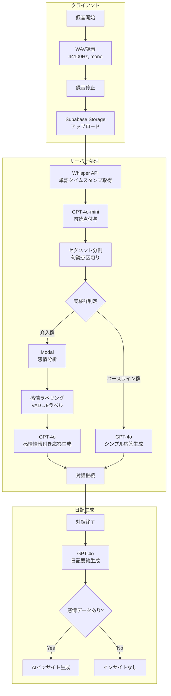

# THESIS_SYSTEM_REFERENCE.md

本書は、卒業論文の「第2章 提案システム」「第3章 実験」の執筆資料として、`mental-app-test/` 配下の実装コードを根拠にシステム仕様を整理したものである。

---

## 1. システム全体構成

### 1.1 技術スタック

| カテゴリ | 技術 | バージョン/詳細 |
|---------|------|----------------|
| フロントエンド | Next.js | 14.2.3 |
| | React | 18.3.1 |
| | TypeScript | 5.1.6 |
| | Tailwind CSS | 3.4.3 |
| 録音 | extendable-media-recorder | 9.2.29（WAVエンコード） |
| 音声認識 | OpenAI Whisper | whisper-1 |
| 句読点付与 | OpenAI GPT-4o-mini | temperature: 0 |
| 音声感情認識 | Wav2Vec2（カスタム） | Modal serverless |
| 対話生成 | OpenAI GPT-4o | max_tokens: 1000 |
| 日記生成 | OpenAI GPT-4o | max_tokens: 1000 |
| バックエンド | Next.js Route Handlers | App Router |
| インフラ | Supabase | PostgreSQL + Storage |
| | Modal | Serverless Python |

### 1.2 システムフロー図



---

## 2. 音声処理

### 2.1 録音仕様

| パラメータ | 値 |
|-----------|-----|
| フォーマット | audio/wav |
| サンプリングレート | 44100 Hz |
| チャンネル数 | 1（モノラル） |
| エコーキャンセル | 有効 |
| ノイズ抑制 | 有効 |
| 自動ゲイン制御 | 有効 |
| データ取得間隔 | 1000ms |

### 2.2 音声認識（Whisper）

```
model: 'whisper-1'
language: 'ja'
response_format: 'verbose_json'
timestamp_granularities: ['word']
```

リトライ: 最大3回、指数バックオフ

### 2.3 句読点付与プロンプト（GPT-4o-mini）

```
以下のテキストに句読点（。、）を付けてください。文の内容は変更せず、句読点のみ追加。

${text}

出力: 句読点を付けたテキストのみ
```

パラメータ: `temperature: 0`, `max_tokens: 2000`

### 2.4 セグメント分割ロジック

1. 句読点付きテキストを1文字ずつ走査
2. `。` または `、` を検出した時点でセグメント確定
3. 各セグメントに対応する単語タイムスタンプを順序ベースでマッピング
4. セグメントの `start_time` = 最初の単語の開始時刻、`end_time` = 最後の単語の終了時刻

---

## 3. 音声感情認識（SER）

### 3.1 モデル構成

**ベースモデル**: `audeering/wav2vec2-large-robust-12-ft-emotion-msp-dim`

**カスタム出力層**:
```python
class CustomWav2Vec2Model(Wav2Vec2Model):
    def __init__(self, config):
        super().__init__(config)
        self.fc = torch.nn.Linear(1024, 3)  # [Arousal, Valence, Dominance]
        self.init_weights()

    def forward(self, input_values):
        output = super().forward(input_values)
        x = torch.mean(output.last_hidden_state, dim=1)  # 時間軸平均プーリング
        x = self.fc(x)
        return x.squeeze()
```

**カスタム重み**: `model_20230425_MSPPodcast.pkl`（MSP-Podcastデータセットでファインチューニング済み、既存の事前学習済みモデルを使用）

### 3.2 前処理パラメータ

| パラメータ | 値 |
|-----------|-----|
| サンプリングレート | 16000 Hz（ffmpegでリサンプリング） |
| チャンネル | モノラル |
| 最小セグメント長 | 0.05秒（それ以下はスキップ） |

### 3.3 感情ラベリング

**VAD閾値定義**（実測データ分布 [3.2, 4.2] に基づき著者が経験的に設定）:

| 定数 | 値 | 説明 |
|------|-----|------|
| CENTER | 3.7 | 中央値 |
| NEUTRAL_MIN | 3.65 | 中立範囲下限 |
| NEUTRAL_MAX | 3.75 | 中立範囲上限 |
| LOW | 3.55 | 低判定閾値 |
| VERY_LOW | 3.45 | 極低判定閾値 |
| HIGH | 3.85 | 高判定閾値 |
| VERY_HIGH | 4.0 | 極高判定閾値 |

**判定アルゴリズム**:

```
入力: A (Arousal), V (Valence), D (Dominance)
出力: 9種類の感情ラベル

1. 中立判定（最優先）
   if V ∈ [3.65, 3.75] AND A ∈ [3.65, 3.75]:
     return "中立"

2. 高覚醒 (A ≥ 3.85)
   if V ≥ 3.85:
     return "喜び・楽しい"
   if V < 3.55:
     if V < 3.45 AND D ≥ 3.85:
       return "怒り・イライラ"
     if D ≥ 3.85:
       return "ストレス・緊張"
     else:
       return "不安・心配"

3. 低覚醒 (A < 3.55)
   if V ≥ 3.85:
     return "穏やか・リラックス"
   if V < 3.55:
     if A < 3.45:
       return "疲労・無気力"
     else:
       return "悲しみ"
   else:
     return "落ち着き"

4. 中程度覚醒 (3.55 ≤ A < 3.85)
   if V ≥ 3.85:
     return "落ち着き"
   if V < 3.55:
     return "悲しみ"
   else:
     return "中立"
```

**9種類の感情ラベル一覧**:

| ラベル | カテゴリ | 条件概要 |
|--------|---------|---------|
| 喜び・楽しい | positive | 高A × 高V |
| 穏やか・リラックス | positive | 低A × 高V |
| 落ち着き | positive | 中〜低A × 中〜高V |
| 中立 | neutral | 中央付近 |
| ストレス・緊張 | negative | 高A × 低V × 高D |
| 不安・心配 | negative | 高A × 低V × 低D |
| 怒り・イライラ | negative | 高A × 極低V × 高D |
| 悲しみ | negative | 低〜中A × 低V |
| 疲労・無気力 | negative | 極低A × 低V |

---

## 4. AI対話生成

### 4.1 介入群 vs ベースライン群の差異

| 項目 | 介入群 | ベースライン群 |
|------|--------|---------------|
| API | `/api/ai-chat` | `/api/ai-chat-baseline` |
| 感情分析 | あり | なし |
| プロンプトへの感情注入 | あり（VAD値+ラベル） | なし |
| ギャップ検出 | あり | なし |
| AIの役割設定 | 共感的メンタルヘルスサポーター | 共感的傾聴者 |
| 音声データガイドライン | あり | なし |

### 4.2 介入群 System Prompt

```
あなたは共感的なメンタルヘルスサポーターです。音声感情認識データを活用して、
ユーザーの本音や感情を引き出し、ポジティブな方向への情動調整をサポートします。

【音声感情データの読み方】
- 「声のエネルギー」: 高い＝活発・興奮、低い＝疲労・落ち込み
- 「感情の明るさ」: ポジティブ＝楽しい・嬉しい、ネガティブ＝悲しい・不安
- 「声の自信度」: 自信あり＝確信を持っている、控えめ＝不安・迷い
- 「前セグメントからの変化」: 話している途中での感情の揺れを示す

【テキストと声のギャップに注目】
言葉では「大丈夫」「問題ない」と言っていても、声のエネルギーが低かったり
ネガティブ傾向の場合は、本音を隠している可能性があります。
その場合は「言葉ではそうおっしゃっていますが、声からは少し違う印象を受けました」
のように優しく触れてください。

【対話の3段階構成（必ず守ること）】
1. バリデーション（感情の受け止め）
   - 音声データから読み取れる感情状態を、自然な言葉で伝える
   - 「お話を聞いていて、少しお疲れのような印象を受けました」
   - ※分析的な表現（「arousalが〜」「トーンが〜」）は禁止

2. 深掘り（背景の理解）
   - 感情の原因となった具体的な出来事を聞く
   - ユーザーの発言から具体的な単語を拾って質問
   - 漠然とした質問（「どうでしたか？」「気分は？」）は禁止

3. リフレーミング（視点の転換）※3往復以上で意識
   - ユーザーが気づいていない強みや対処リソースを見つけて伝える
   - ※説教やアドバイスではなく、ユーザー自身が気づくよう促す

【禁止事項】
- 決めつけ、説教、安易なアドバイス
- 感情の押し付け（「辛かったですね」と断定しない）
- 反芻思考の助長（ネガティブな話題を深掘りしすぎない）
- 「〜すべき」「〜した方がいい」という指示的表現

【応答スタイル】
- 2-3文で簡潔に
- 質問は1つに絞る
```

### 4.3 ベースライン群 System Prompt

```
あなたは共感的な傾聴者です。ユーザーの話を丁寧に聞き、理解を深めるための質問をします。

【対話のガイドライン】
1. 共感的な受け止め
   - ユーザーの発言を丁寧に受け止める
   - 「そうだったんですね」「なるほど」など自然な相槌
   - 決めつけや押し付けはしない

2. 深掘り質問
   - 具体的な出来事や状況を聞く
   - ユーザーの発言から具体的な単語を拾って質問
   - 漠然とした質問は避ける

3. 自然な対話
   - 説教やアドバイスはしない
   - ユーザー自身が考えを整理できるようサポート

【禁止事項】
- 決めつけ、説教、安易なアドバイス
- 「〜すべき」「〜した方がいい」という指示的表現
- 感情の押し付け

【応答スタイル】
- 2-3文で簡潔に
- 質問は1つに絞る
```

### 4.4 感情データのプロンプト注入形式

**セグメント詳細の整形例**:
```
セグメント1: "今日は仕事が忙しかった。"
  感情: ストレス・緊張
  声のエネルギー: やや高い
  感情の明るさ: 落ち着いている
  声の自信度: 普通

セグメント2: "でも、なんとか終わらせることができた。"
  感情: 落ち着き
  声のエネルギー: 普通
  感情の明るさ: やや明るい
  声の自信度: 自信あり
  ※前セグメントからの変化: 気分↑
```

**VAD値から表現への変換閾値**:

| VAD値範囲 | 声のエネルギー | 感情の明るさ | 声の自信度 |
|-----------|--------------|-------------|-----------|
| > 0.6 | 高い | ポジティブ | 自信あり |
| > 0.4 | やや高い | やや明るい | 普通 |
| > 0.25 | 普通 | 落ち着いている | 普通 |
| ≤ 0.25 | 低い | ネガティブ傾向 | 控えめ・不安気 |

**セグメント間変化の検出**:
- 閾値: |ΔA| > 0.15 または |ΔV| > 0.15
- 表示: 「活力↑/↓」「気分↑/↓」

### 4.5 ギャップ検出ロジック（介入群のみ）

```
ポジティブワード = ['大丈夫', '問題ない', '平気', '元気', '楽しい', '嬉しい', '良かった', 'うまくいった']
ネガティブワード = ['疲れた', '辛い', '悲しい', '不安', '心配', '失敗', 'ダメ', '最悪']

声がネガティブ: avg_valence < 0.35 OR avg_arousal < 0.3
声がポジティブ: avg_valence > 0.55 AND avg_arousal > 0.4

判定:
- ポジティブ語 AND 声がネガティブ → 「本音を隠している可能性」
- ネガティブ語 AND 声がポジティブ → 「乗り越えつつある可能性」
```

> 注: ギャップ検出の閾値（0.x台）と感情ラベリングの閾値（3.x台）はスケールが異なる。

---

## 5. 日記生成

### 5.1 日記要約プロンプト

```
以下の発言内容から、その人が書いた日記を作成してください。

【発言内容】
${userOnlyContent}

【日記のスタイル】
- 発言者の話し方や言葉遣いに合わせた文体で書く
- 「〜した」「〜だった」「〜と思う」など、日記らしい過去形の語尾を基本とする
- 言っていないことは書かない

【形式】
- 2-3段落、150-200文字程度
- 日付や箇条書きは使わない
```

### 5.2 AIインサイトプロンプト（介入群のみ）

```
以下の音声分析結果と会話内容から、カウンセラーとして今日の心の状態についてフィードバックしてください。

【音声分析結果】
全体的な感情: ${dominantEmotion}
感情の変化: ${emotionFlow}
感情の分布: ${emotionCounts}

【会話内容】
${fullConversation}

【要件】
- 音声から読み取れた感情の特徴を、具体的な会話内容と紐づけて伝える
- 「〜についてお話しされている時、声に力強さがありました」のように具体的に
- 感情の揺れや変化があれば、それが何を意味しているか優しく伝える
- ポジティブな変化や強みがあれば、積極的に取り上げる
- 3-4文、120-180文字程度
- 共感的で温かい口調（説教・アドバイスは禁止）
```

---

## 6. 実験設計パラメータ

| パラメータ | 値 |
|-----------|-----|
| 1日の録音上限 | 5回 |
| 1回の最大録音時間 | 60秒 |
| 日記生成の最小発言数 | 2回 |
| 対話区切り提案 | 3往復以上 |

---

## 7. 画面構成

### 7.1 AIとの対話画面（`/ai-dialogue-web`）

- 実験群切替（介入群/ベースライン群）タブ
- 音声録音・波形可視化
- リアルタイム文字起こし表示
- 感情ラベルに応じた色付きテキスト表示（介入群）
- セグメントごとの感情推移グラフ表示（介入群）
- 対話履歴表示
- 日記生成ボタン

### 7.2 ダッシュボード（`/dashboard-web`）

- 過去90日分の日記一覧
- 日付選択による日記詳細表示
- 感情分析結果の可視化（グラフ）

---

## 付録: 引用すべき技術

| 技術 | 引用元 |
|------|--------|
| Wav2Vec2 | Baevski et al., 2020 |
| audeering/wav2vec2-large-robust-12-ft-emotion-msp-dim | Hugging Face Model Hub |
| MSP-Podcast | Lotfian & Busso, 2019 |
| OpenAI Whisper | Radford et al., 2022 |
| GPT-4o | OpenAI, 2024 |
